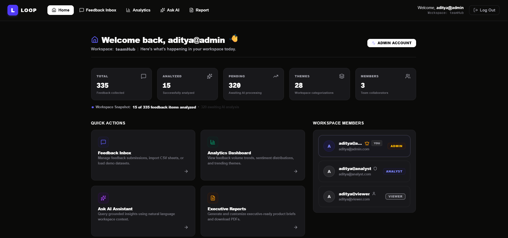
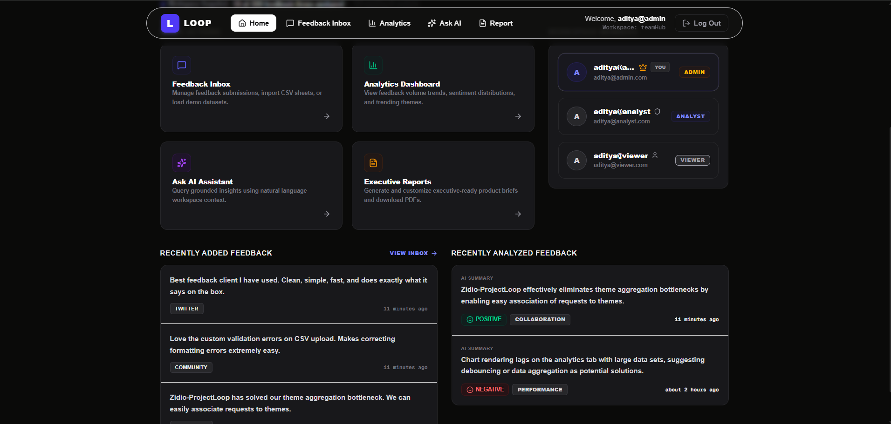
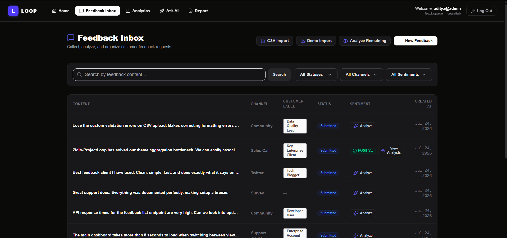
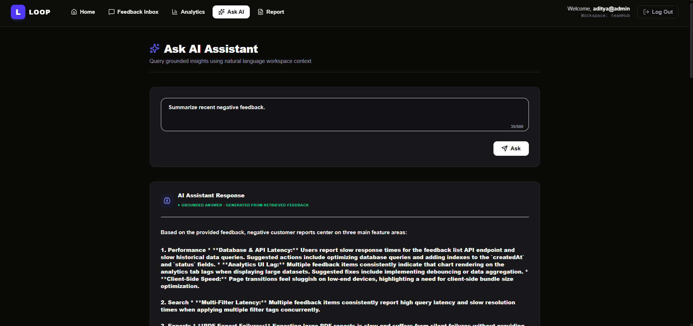
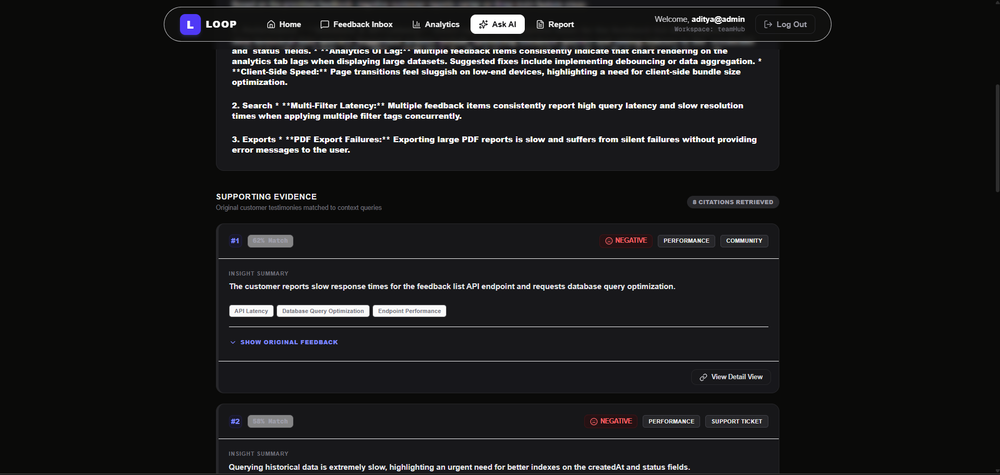
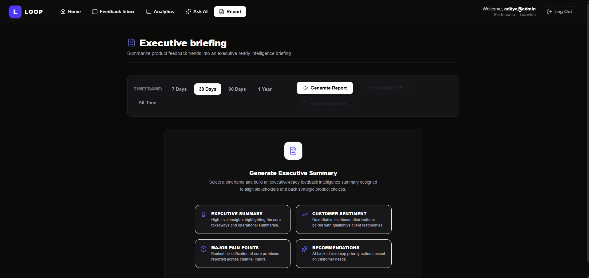
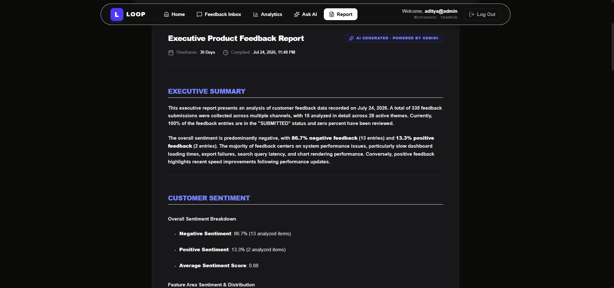
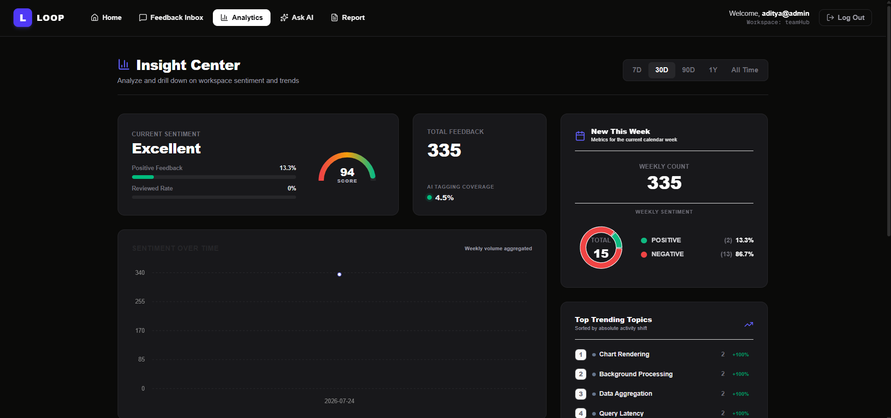
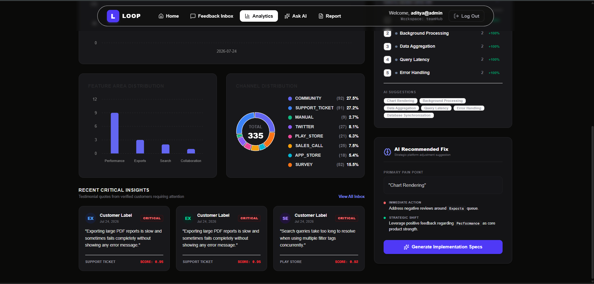

<div align="center">

# LOOP

### AI-Powered Customer Feedback Intelligence Platform

Transform scattered customer feedback into prioritized product insights using AI, semantic search, vector embeddings, and retrieval-augmented generation.

<br/>


<br/>

**AI Analytics • Semantic Search • Multi-Tenant Workspaces • Executive Reports • RAG • Product Intelligence**

<br/>

<!-- Live Demo -->

</div>

---

# Overview

Customer feedback is one of the most valuable assets for product teams, yet it usually lives across disconnected platforms like support tickets, app store reviews, surveys, community discussions, spreadsheets, and sales conversations.

LOOP brings all of that information into a single workspace where AI continuously analyzes feedback, identifies recurring problems, extracts themes, measures customer sentiment, and enables semantic search over historical conversations.

Instead of manually reading hundreds of tickets, product managers can understand what customers are asking for within seconds.

```text
              Feedback Sources
                     │
     ┌───────────────┼────────────────┐
     │               │                │
     ▼               ▼                ▼
 CSV Upload     Manual Entry     Demo Import
                     │
                     ▼
          Feedback Ingestion Pipeline
                     │
                     ▼
              AI Analysis Engine
     ┌────────────┬──────────────┬─────────────┐
     ▼            ▼              ▼
 Sentiment     Theme Detection   Summaries
                     │
                     ▼
         PostgreSQL + pgvector
                     │
        ┌────────────┴────────────┐
        ▼                         ▼
 Product Analytics         Semantic Search
        │                         │
        └────────────┬────────────┘
                     ▼
            Executive AI Reports
```

---

# Product Preview

### Dashboard

<table>
  <tr>
    <td colspan="2" align="center">
      <strong>Dashboard</strong>
    </td>
  </tr>
  <tr>
    <td></td>
    <td></td>
  </tr>
</table>

### Feedback Inbox

<p align="center">

</p>

### AI Analysis

<table>
  <tr>
    <td colspan="2" align="center">
      <strong>Analysis</strong>
    </td>
  </tr>
  <tr>
    <td></td>
    <td></td>
  </tr>
</table>

### Executive Reports

<table>
  <tr>
    <td colspan="3" align="center">
      <strong>Report</strong>
    </td>
  </tr>
  <tr>
    <td></td>
    <td></td>
  </tr>
</table>

### Analytics

<table>
  <tr>
    <td colspan="2" align="center">
      <strong>Analytics</strong>
    </td>
  </tr>
  <tr>
    <td></td>
    <td></td>
  </tr>
</table>

---

# Why LOOP?

Modern companies receive customer feedback from dozens of different channels.

Most teams struggle because feedback is:

- scattered across platforms
- duplicated
- difficult to prioritize
- impossible to search semantically
- expensive to analyze manually

LOOP centralizes this information and augments it with AI to transform raw feedback into actionable product intelligence.

Rather than replacing product teams, LOOP accelerates how quickly they discover customer problems, understand trends, and make roadmap decisions.

---

# Core Features

## 📥 Multi-Source Feedback Ingestion

- Manual feedback submission
- CSV bulk imports
- Demo dataset generation
- Workspace isolation
- Duplicate detection pipeline
- Feedback validation

---

## 🧠 AI Analysis

- Sentiment Analysis
- Theme Extraction
- Keyword Extraction
- Executive Summaries
- Structured Metadata
- Embedding Generation

---

## 🔎 Semantic Search

Traditional keyword search cannot answer questions like:

> "Users complaining about slow onboarding"

or

> "Payment issues affecting enterprise customers"

LOOP generates embeddings for every feedback document and stores them inside pgvector, allowing semantic similarity search instead of simple keyword matching.

---

## 📊 Analytics

- Sentiment Trends
- Theme Distribution
- Customer Segments
- Channel Insights
- Executive Dashboard

---

## 📄 Executive Reports

Generate concise reports summarizing:

- major customer pain points
- feature requests
- product risks
- positive feedback
- customer satisfaction
- suggested priorities

Designed for founders, product managers, engineering leads and executives.

---

## 🏢 Multi-Tenant Workspaces

Every organization operates inside an isolated workspace.

Each workspace owns:

- users
- feedback
- AI analysis
- reports
- analytics
- embeddings

ensuring complete tenant isolation throughout the application.

---

## 🔐 Authentication & Authorization

- NextAuth v5
- JWT Sessions
- Role Based Access Control
- Workspace authorization
- Protected server actions
- Secure API routes

---

# AI Pipeline

Unlike many AI projects that simply call an LLM and display the response, LOOP builds a structured analysis pipeline.

```text
                    New Feedback
                          │
                          ▼
                  Content Validation
                          │
                          ▼
                 Duplicate Detection
                          │
                          ▼
                 Embedding Generation
                          │
                          ▼
                  Vector Persistence
                          │
                          ▼
                  LLM Analysis Engine
                          │
          ┌───────────────┼────────────────┐
          ▼               ▼                ▼
     Sentiment       Theme Extraction    Summary
          │               │                │
          └───────────────┼────────────────┘
                          ▼
               Structured AI Metadata
                          │
                          ▼
          Analytics + Reports + Search
```

The AI layer is intentionally separated from the ingestion pipeline so future models can be swapped without affecting the rest of the application.

---

# Engineering Highlights

LOOP focuses on building production-oriented backend systems rather than showcasing isolated AI API calls.

Key engineering decisions include:

### Feature-Based Architecture

Frontend and backend are organized around business domains instead of technical layers, making features easier to scale independently.

---

### Retrieval-Augmented Generation

Executive reports and AI responses are generated using retrieved workspace context instead of relying entirely on model memory.

---

### Vector Database Integration

Every feedback document is converted into embeddings and indexed using pgvector, enabling semantic retrieval across thousands of records.

---

### Structured AI Outputs

Instead of storing plain AI text, LOOP persists structured metadata including sentiment, themes, summaries and embeddings.

This enables:

- dashboard generation
- filtering
- analytics
- semantic search
- report generation

without repeatedly querying the language model.

---

### Workspace Isolation

Every query is scoped to a workspace.

This guarantees one organization's feedback never becomes accessible to another tenant.

---

### Type-Safe Backend

The application uses:

- TypeScript
- Prisma ORM
- Zod validation
- typed database models
- strongly typed API contracts

to reduce runtime errors and improve maintainability.

---

# System Architecture

```text
                         Next.js Application
                                 │
                     React + Server Components
                                 │
                    TanStack Query + Server Actions
                                 │
                    Authentication (NextAuth v5)
                                 │
              ┌──────────────────┼──────────────────┐
              ▼                  ▼                  ▼
        Feedback API        AI Services       Analytics
              │                  │                  │
              └──────────────────┼──────────────────┘
                                 ▼
                       Prisma ORM + PostgreSQL
                                 │
                     pgvector Semantic Search
                                 │
                                 ▼
                          Google Gemini API
```

---

# Technology Stack

| Layer | Technologies |
|-------|--------------|
| Frontend | Next.js 16, React 19, TypeScript |
| Styling | Tailwind CSS |
| Forms | React Hook Form, Zod |
| Authentication | NextAuth v5 |
| Database | PostgreSQL |
| ORM | Prisma |
| AI | Google Gemini, Vercel AI SDK |
| Vector Search | pgvector |
| State Management | TanStack Query |
| Deployment | Vercel |

---

# Project Structure

```text
src/
│
├── app/
├── components/
├── features/
├── server/
│   ├── modules/
│   ├── lib/
│   ├── ai/
│   ├── auth/
│   └── db/
│
├── hooks/
├── providers/
├── types/
└── utils/

docs/
├── architecture.md
├── database.md
├── flows.md
├── api.md
├── apiContracts.md
└── scaling.md
```
---

# Documentation

- architecture.md
- database.md
- flows.md
- api.md

---

# Getting Started

```bash
git clone https://github.com/forest-whispers/Zidio-ProjectLoop.git

cd loop
npm install

## cut FeedbackEmbedding table temporarily from /prisma/schema.prisma
## also remove the join with Feedback table
npx prisma migrate dev --name init
npx prisma generate
## reinsert the FeedbackEmbedding and the join with Feedback table
npx prisma format
npx prisma migrate dev --create-only --name add_feedback_embeddings
## add the following to the new add_feedback_embeddings migration inside /prisma/migrations
### add the below at the top of the migration file
###### -- Enable pgvector extension if not enabled
######CREATE EXTENSION IF NOT EXISTS vector;
### add the below at the top of the migration file
###### -- Create HNSW Index
###### CREATE INDEX IF NOT EXISTS feedback_embedding_hnsw_idx 
###### ON "FeedbackEmbedding" 
###### USING hnsw (embedding vector_cosine_ops);
npx prisma migrate deploy

# Environment Variables

Check out .env.example

---

# Running the Development Server

```bash
npm run dev
```
Visit http://localhost:3000

---

# Deployment

The application is designed for deployment using modern serverless infrastructure.

| Layer | Platform |
|--------|----------|
| Frontend | Vercel |
| Backend | Next.js Server Actions / Route Handlers |
| Database | PostgreSQL |
| ORM | Prisma |
| Vector Search | pgvector |
| AI | Google Gemini |

---

# Roadmap

The current version establishes the core feedback intelligence platform.

Future iterations may include the following enhancements.

## Integrations

- Zendesk
- Intercom
- Slack
- Discord
- GitHub Issues
- Jira
- Linear
- Play Store
- App Store
- HubSpot

---

## AI Improvements

- Duplicate clustering
- Topic clustering
- Feature request grouping
- Trend prediction
- Churn risk detection
- Customer segmentation
- Competitive analysis
- Automatic release notes
- AI-powered roadmap suggestions

---

## Search Improvements

- Hybrid search
- Cross-workspace search
- Metadata filtering
- Citation-aware answers

---

## Platform Features

- Background workers
- Job queues
- Scheduled imports
- Email digests
- Webhooks
- Team collaboration
- Comment threads
- Saved searches
- Custom dashboards
- Notification center

---

## Infrastructure

- Redis caching
- Streaming responses
- Horizontal scaling
- Observability
- Rate limiting
- Monitoring
- OpenTelemetry
- Background AI processing

---

# Contributing

Contributions, suggestions and discussions are always welcome.

If you'd like to improve LOOP, feel free to open an issue or submit a pull request.

---

# License

This project is licensed under the MIT License.

---

<div align="center">

### Built to explore modern AI-native software engineering.

Rather than treating AI as a chatbot, LOOP demonstrates how language models, vector databases, retrieval-augmented generation, semantic search and structured analytics can work together inside a production-oriented SaaS application.

**LOOP — Turning customer feedback into product intelligence.**

</div>